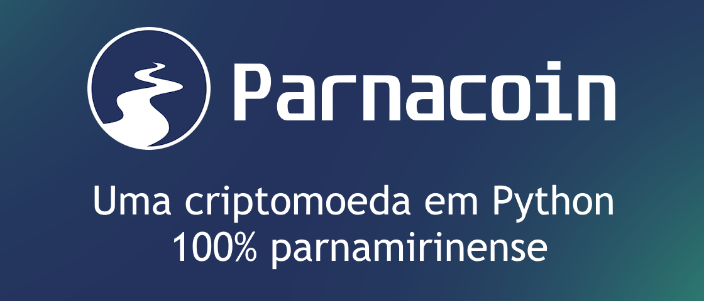

# 🪙 Parnacoin

 

A **Parnacoin** é uma criptomoeda baseada no modelo **Proof-of-Work (PoW)** da Bitcoin, desenvolvida inteiramente em **Python**. O objetivo do projeto é desmistificar o mundo da criptografia e incentivar o público a entender essa tecnologia financeira — construindo, do zero, os blocos essenciais de uma blockchain funcional.


---

## ✨ O que o projeto implementa

Diferente de simulações superficiais, a Parnacoin reproduz mecanismos reais de uma blockchain:

- **Carteiras com criptografia assimétrica** — cada usuário gera um par de chaves **RSA de 2048 bits**; a chave pública funciona como endereço.
- **Transações assinadas digitalmente** com **RSA-PSS + SHA-256**, verificáveis por qualquer nó da rede.
- **Hash duplo SHA-256** (padrão inspirado na Bitcoin) para identificar transações e blocos.
- **Mineração via Proof-of-Work** — busca de `nonce` até o hash do bloco atingir o número exigido de zeros binários à esquerda (dificuldade).
- **Raiz de Merkle** para resumir as transações de cada bloco.
- **Recompensa ao minerador** de 10 PARNA + soma das taxas das transações incluídas.
- **Mempool com priorização por taxa** — o minerador escolhe as transações mais lucrativas (até 100 por bloco).
- **Verificação de saldo** percorrendo todo o histórico da cadeia antes de aceitar uma transação.
- **Rede P2P simulada via MQTT** — nós trocam transações e blocos por tópicos publish/subscribe.
- **Validação completa de blocos** — estrutura, assinaturas, saldo, raiz de Merkle, dificuldade, encadeamento (`hash_anterior`) e ordem temporal.

---

## 🏗️ Arquitetura

A rede é composta por **usuários** (que criam transações) e **mineradores** (que validam, mineram e propagam blocos). A comunicação acontece por um **broker MQTT** em dois tópicos:

| Tópico            | Conteúdo                          |
| ----------------- | --------------------------------- |
| `rede-parnacoin`  | Transações novas (mempool)        |
| `rede-blocos`     | Blocos minerados                  |

```
┌──────────────┐   transação    ┌───────────────┐   bloco minerado   ┌───────────────┐
│   Usuário    │ ─────────────► │  Broker MQTT  │ ◄───────────────── │  Minerador(es)│
│ (usuario.py) │  rede-parnacoin│  (Mosquitto)  │    rede-blocos     │ (minerador.py)│
└──────────────┘                └───────┬───────┘                    └───────┬───────┘
                                        │ propaga a todos os nós inscritos   │
                                        ▼                                    ▼
                                  valida assinatura,               minera (PoW), monta o bloco
                                  saldo e formato                  e grava em blockchain.txt
```

---

## 🔄 Ciclo de vida de uma transação

1. O usuário monta a transação (beneficiário, quantidade, taxa) e a **assina** com sua chave privada.
2. O ID da transação é calculado por **duplo SHA-256** do conteúdo serializado.
3. A transação é publicada no tópico `rede-parnacoin`.
4. O minerador recebe, **valida a assinatura e o saldo**, e a adiciona à mempool.
5. Ao minerar, o minerador seleciona as transações de maior taxa, cria a **transação de recompensa**, monta o bloco e resolve o **Proof-of-Work** (incrementando o `nonce`).
6. O bloco válido é publicado em `rede-blocos`; os demais nós o validam e o anexam à cadeia em `blockchain.txt`.

---

## 🛠️ Tecnologias

- **Python 3**
- **[cryptography](https://cryptography.io/)** — geração de chaves RSA, assinatura e verificação (RSA-PSS/SHA-256)
- **[paho-mqtt](https://pypi.org/project/paho-mqtt/)** — comunicação entre nós da rede
- **[python-dateutil](https://pypi.org/project/python-dateutil/)** — parsing de timestamps
- Módulos padrão: `hashlib`, `json`, `base64`, `zoneinfo`

---

## 📁 Estrutura do projeto

```
Parnacoin/
├── classes.py        # Núcleo: hashing, chaves RSA, classes Base / Usuario / Minerador
├── genese.py         # Gera o bloco gênese (bloco 0) da blockchain
├── usuario.py        # Cliente/carteira: cria e publica transações na rede
├── minerador.py      # Nó minerador: valida, minera (PoW) e propaga blocos via MQTT
├── isEqual.py        # Utilitário de depuração p/ comparar chaves públicas (provisório)
├── blockchain.txt    # A blockchain persistida em JSON (cadeia principal "0")
├── dados.txt         # Par de chaves RSA do nó (PEM em base64) — gerado automaticamente
├── requirements.txt  # Dependências
└── repo-cover.png    # Capa do projeto
```

---

## 🚀 Como executar

### 1. Pré-requisitos

- **Python 3.9+** (usa `zoneinfo`)
- Um **broker MQTT** rodando localmente. O mais comum é o [Mosquitto](https://mosquitto.org/):
  ```bash
  # Ubuntu/Debian
  sudo apt install mosquitto
  sudo systemctl start mosquitto
  ```
  Por padrão, os nós esperam o broker em `127.0.0.1:1883`.

### 2. Instale as dependências

```bash
git clone https://github.com/samuelaugustowvw/Parnacoin.git
cd Parnacoin
pip install -r requirements.txt
```

### 3. Crie o bloco gênese

```bash
python genese.py
```
Isso gera o `blockchain.txt` com o bloco 0 e uma transação de recompensa inicial.

### 4. Inicie um minerador

```bash
python minerador.py
```
O minerador conecta ao broker, escuta transações e blocos, e passa a minerar quando houver transações na mempool.

### 5. Envie uma transação (em outro terminal)

```bash
python usuario.py
```
Cria uma transação de teste assinada e a publica na rede — o minerador irá recebê-la, validá-la e incluí-la no próximo bloco.

> 💡 Na primeira execução, cada nó gera automaticamente seu par de chaves RSA e o salva em `dados.txt`. Guarde esse arquivo: ele é a "carteira" daquele nó.

---

## ⚙️ Parâmetros principais

| Parâmetro             | Onde                | Valor padrão | Descrição                                        |
| --------------------- | ------------------- | ------------ | ------------------------------------------------ |
| `alvo_dificuldade`    | `minerador.py`      | `24`         | Zeros binários exigidos no hash do bloco (PoW)   |
| Recompensa base       | `classes.py`        | `10.0`       | PARNA pagos ao minerador por bloco               |
| Máx. transações/bloco | `minerador.py`      | `100`        | Limite de transações incluídas por bloco         |
| Tamanho da chave RSA  | `classes.py`        | `2048 bits`  | Par de chaves de cada carteira                   |

---

## ⚠️ Avisos

Este é um projeto **educacional**. Alguns pontos a ter em mente:

- A chave privada é salva **sem criptografia** em `dados.txt` — adequado para estudo, não para valores reais.
- O broker MQTT centralizado simula a rede P2P, mas não é descentralizado como uma blockchain de produção.
- Arquivos como `isEqual.py` e alguns `print()` de depuração são auxiliares de desenvolvimento e podem ser removidos em uma versão final.
- Não há tratamento de *forks*/reorganização de cadeia — assume-se a cadeia principal `"0"`.

---

## 👥 Autores

Projeto desenvolvido em parceria por:

- **Samuel Augusto** — [@samuelaugustowvw](https://github.com/samuelaugustowvw)
- **Gabriel S. Pereira** — [@gabriel-per](https://github.com/gabriel-per)

Uma criptomoeda em Python 100% parnamirinense. 🌎
